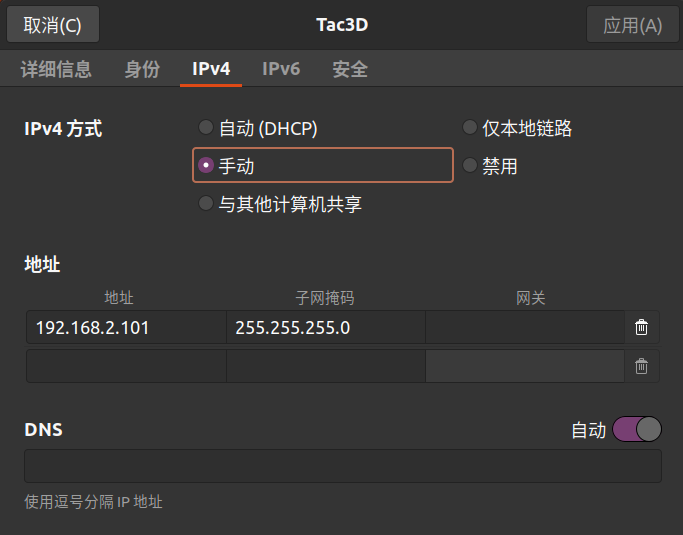
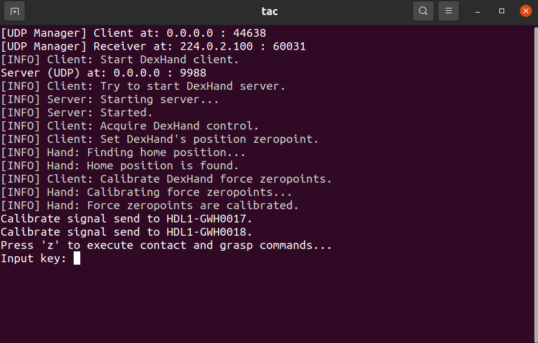
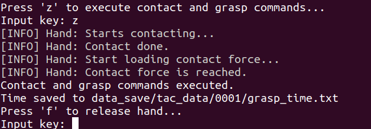
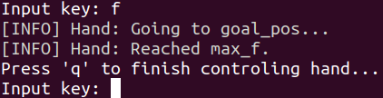
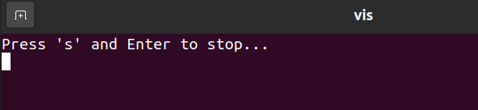
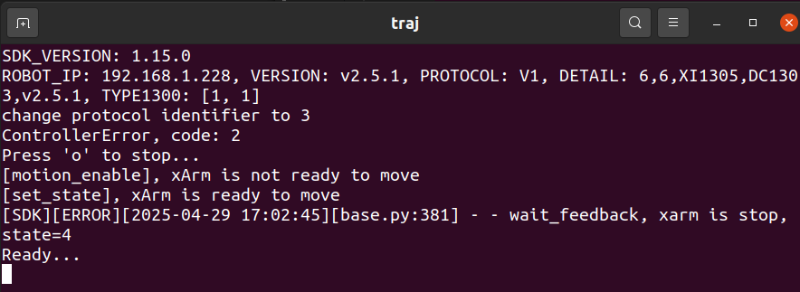
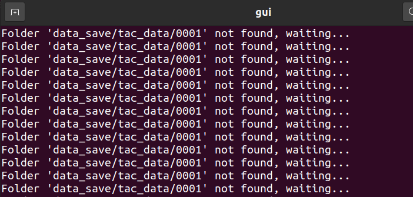
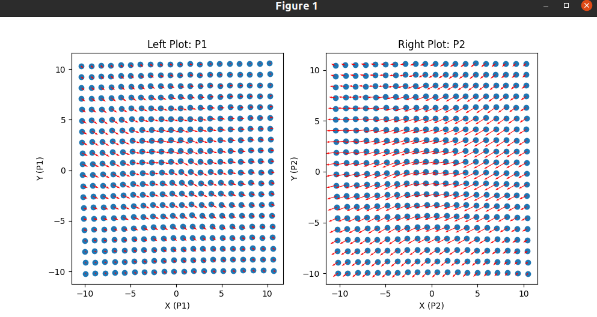

# Read me

## 一、仓库下载

### 1. 创建文件夹
```
mkdir -p real
cd real
```

### 2. 下载scripts仓库
```
git clone https://github.com/xiaox23/scripts.git
```

### 3. 下载Tac3D仓库

```
git clone https://github.com/xiaox23/Tac-3D.git
```

### 4. 下载Realsense仓库

```
git clone https://github.com/xiaox23/collect_RGBD.git
```

### 5. 下载xarm仓库

```
git clone https://github.com/xiaox23/xArm-Python-SDK.git
```

## 二、环境和真机setup
### 1. 触觉
```
cd Tac-3D
```
创建&激活环境
```
conda create -n real python=3.8
conda activate real
```

安装Tac3D需要的包
```
cd DexHand-SDK-v1.1/pyDexHandClient
pip install .
```

Tac3D和电脑通过网线连接，需要将有线网的ip设置如下：



运行激活demo
```
cd ../../../
python DexHand-SDK-v1.1/pyDexHandClient/examples/activate_service.py
```
终端输出下面的表示正常激活
```
[UDP Manager] Client at: 0.0.0.0 : 42044
[UDP Manager] Receiver at: 224.0.2.100 : 60031
[INFO] Client: Start DexHand client.
[INFO] Client: Try to start DexHand server.
[INFO] Server: Starting server...
[INFO] Hand: DexHand has initialized successfully.
[INFO] Tac3D: Tac3D has initialized successfully
[INFO] Server: Started.
[INFO] Client: exiting program.
```

运行其他夹爪demo
```
python DexHand-SDK-v1.1/pyDexHandClient/examples/get_info.py
```

```
python DexHand-SDK-v1.1/pyDexHandClient/examples/grasp_force_control.py
```

```
python DexHand-SDK-v1.1/pyDexHandClient/examples/move_dexhand.py
```
运行触觉demo需要先安装一些包
```
pip install numpy ruamel.yaml vedo==2023.4.6 vtk==9.1.0  # 视触觉传感器要用的库
pip install opencv-python
```
检查包有没有安装成功
```
pip list | grep vedo
pip list | grep vtk
```
输出如下，安装成功
```
vedo                          2023.4.6
vtk                           9.1.0
```
运行触觉demo

```
python DexHand-SDK-v1.1/pyDexHandClient/examples/PyTac3D.py
```

```
# 下面的内容要在运行前修改
# Tac3D_name1 = "HDL1-GWH0017"
# Tac3D_name2 = "HDL1-GWH0018"
python DexHand-SDK-v1.1/pyDexHandClient/examples/handandtac3d.py
```

### 2. 视觉
```
cd ..
git clone https://github.com/IntelRealSense/librealsense
```

```
cd librealsense
sudo apt-get install libudev-dev pkg-config libgtk-3-dev
sudo apt-get install libusb-1.0-0-dev pkg-config
sudo apt-get install libglfw3-dev
sudo apt-get install libssl-dev
```

```
mkdir build
cd build
cmake ../ -DBUILD_EXAMPLES=true
make
sudo make install 
```
运行视觉gui
```
realsense-viewer
```
安装视觉python包
```
pip install pyrealsense2
```
运行视觉demo
```
cd ../../
cd collect_RGBD
python pyrealsense2/realsense.py
cd ..
```
### 3. 机械臂

```
cd xArm-Python-SDK
python setup.py install
cd ..
```

获取位置信息

```
python xArm-Python-SDK/control/get_info.py
```

示教模式

```
python xArm-Python-SDK/control/teach.py
```

home模式

```
python xArm-Python-SDK/control/home.py
```

3D鼠标遥操测试

```
python xArm-Python-SDK/control/teach.py
```

## 三、实机数据采集脚本使用说明

记得先激活夹爪
```
python Tac-3D/DexHand-SDK-v1.1/pyDexHandClient/examples/activate_service.py
```

### 1. 采集脚本

```
# 运行触觉+视觉的采集代码，但是记得修改实验次数！！！每次数据采集都要修改
sh scripts/run_Hscripts.sh
```

会弹出四个terminal和一个二维可视化marker_flow形变力的界面：

#### a. 触觉界面

按下`z`使机械臂开始抓取



按下`f`使机械臂松手



按下`q`退出触觉程序



#### b. 视觉界面

按下`s`使得相机停止数据存储



#### c. 轨迹界面

按下`o`使得机械臂退出程序



#### d. 可视化界面

包含一个terminal和一个图窗，**关掉图窗退出功能**





### 2. 数据处理脚本

#### a. 数据对齐
```
python scripts/H05pair_data.py
```

对于原始信号做一个对齐处理，把视觉数据和触觉数据和轨迹一起保存在新的文件夹`data_save/combined_data`中。认为夹爪抓紧时候为起点。

#### b. 数据可视化
```
python scripts/H06vis_data.py
```

对于匹配之后的数据做可视化，然后把图片存在`data_save1/cal_plots`中。认为夹爪抓紧时候为起点。


## 四、常见问题

### 1. 机械臂

**报错清除**：按下**急停**，然后命令行清除报错：

```
python xArm-Python-SDK/control/clearn_error.py
```

### 2. Tac3D

检查端口占用
```
sudo lsof -i :9988
```
然后`kill -9 进程号`杀死程序


